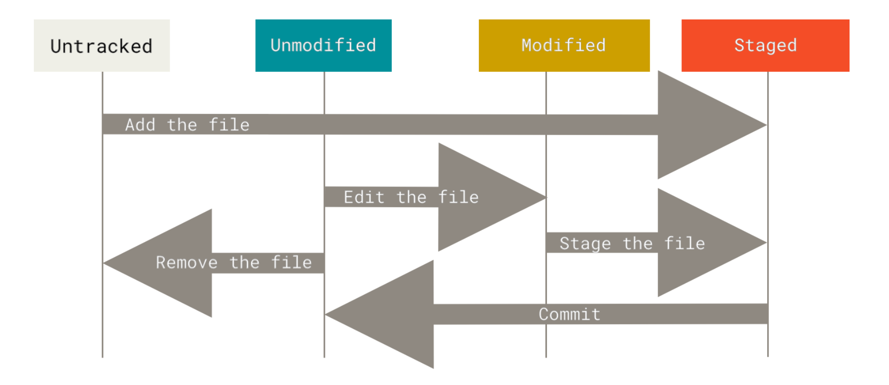

# Git
Git is a source version control system that helps us to track project changes.  
you can download and install it from [Git-SCM Website](https://git-scm.com) website based on your OS. 

**Simple process:**   
1. Adding/Modifying file
2. Adding file to the stage area by `git add filename` command
3. Committing stage area files by running `git commit -m "Message"`

**Basic Configuration**:  
`git config --global user.name "Kamran Sadin"`  
`git config --global user.email "MrSadin@Gmail.Com"`  

**Show configurations**:  
`git config --list`  

You have `Working directory`, `Staging area`, and `Repository`.  

## What is the Staging area?

To understand what is staging area is, let’s take a real-world example – suppose that you are moving to another place, and you have to pack your stuff into boxes and you wouldn’t want to mix the items meant for the bathroom, kitchen, bedroom, and the living room in the same box. So, you will take a box and start putting stuff into it, and if doesn’t make sense, you can also remove it before finally packing the box and labeling it.

Here, in this example, the box serves as the staging area, where you are doing the work (crafting your commit), whereas when you are done, then you are packing it and labeling it (committing the code).

In technical terms, the staging area is the middle ground between what you have done to your files (also known as the working directory) and what you had last committed (the HEAD commit). As the name implies, the staging area gives you space to prepare (stage) the changes that will be reflected on the next commit. This surely adds up some complexity to the process, but it also adds more flexibility to selectively prepare the commits as they can be modified several times in the staging area before committing.

Assume you’re working on two files, but only one is ready to commit. You don’t want to be forced to commit both files, but only the one that is ready. This is where Git’s staging area comes in handy. We place files in a staging area before committing what has been staged. Even the deletion of a file must be recorded in Git’s history, therefore deleted files must be staged before being committed.  

You can add your changed files to the staging area by `git add .` (will add all changed files to the staging area) or `git add filename` (will change only files that you write instead of filename (multiple files separated by space are accepted)).  

If you wanted to commit your changes without adding them to the staging area, you can use `git commit -a` command, then your default editor will pop up, and you can set a commit message for it.  

You can see the commits list by using `git log` command.  
`git log -p` will show each commit changes one by one in separate pages.  
`git log --oneline` will show logs of commits and each commits in one line.  
`git log --graph` will show commits log in the shape of a graph, while you are using branches this will help you to graphically separate each branch commits.  


`git diff` will show all changes that you have made after your last commit.  
`git diff filename` will show only changes you have made on files that you write instead of filename after your last commit.  

**Pulling out files from staging area**:  
1. `git rm --cached filename` will pull out only the file that you write instead of filename from the staging area.
2. `git rm --cached -rm .` this will pull out all files from the staging area.
3. `git restore --staged filename` will pull out your file from staging area.  

`git rm --cached file` : removes the copy of the file from the index / staging-area, without touching the working tree copy. The proposed next commit now lacks the file. If the current commit has the file, and you do in fact make the next commit at this point, the difference between the previous commit and the new commit is that the file is gone.

`git restore --staged file` : Git copies the file from the HEAD commit into the index, without touching the working tree copy. The index copy and the HEAD copy now match, whether or not they matched before. A new commit made now will have the same copy of the file as the current commit.

**There are 4 areas:**
1. Workspace
2. Staging index
3. Local repository
4. Remote repository

- You add your changed files to the staging area to get prepared for commit by running `git add filename` or `git add -A` or `git add .` command.
- You commit your staged files and save them in the local repository by running `git commit -m "Your Message"` command.
- You push your commits to the remote repository by running `git push -u ...` command.
- You pull your codes from the remote repository into your workspace by running `git pull` command.
- You pull your files from the remote repository into the local repository by calling `git fetch` command.

**Files will have 4 modes as below:**
  

- Newly created files are Untracked files.
- Files with no changes since the last commit are Unmodified files.
- Files that you have changed them since your last commit are Modified files.
- Files that are in the staging area that is prepared for committing are Staged files.

`git checkout -- .`: Imagine you have some files in the staging area and before committing them, you made some changes on those files, now you have some staged files that contain new changes, now if you run the `git checkout -- .` those changes that were implemented before `git add .` will remain but those changes that you have made after adding them to staging area will revert.  

`git reset —soft ID` will change only the repository, it will not affect on working directory and staging area.  
- This means that by running this command your repository will revert to the ID commit but you will have your staged area and working directory.  

`git reset —mixed ID` will change the repository and staging area, it wouldn’t affect on working directory.  
- This means that by running this command, you will revert repository changes and you wouldn't have your staged files, only you will have your unstaged files.  

`git reset —hard ID` will change all three areas, the working directory, staging area, and repository.  
- This one means that after running this command, you will reset your all changes, and all areas to your last commit, you wouldn't have any changes on any areas after your last commit, so be careful about using this one!  


## Git Branches
Imagine, you are working on a project. You are working with a team and everyone is responsible to develop a feature on this project, so without git and branches how would you develop the project parallelly!? The more important question is, how would you merge your code with existing code!?  
Everyone should work on his/her computer and then when you want to merge, you need to copy/paste all new files and you would check existing file changes to copy line by line! Is it possible!?  
By using git branches, everyone can have one branch and work on the feature, then you can merge this branch into your main branch, git will take care of adding new files and even adding new lines of code on existing files! Even more, if you changed existing files like replacing some codes, you would have options to choose to keep your main branch codes or replace new changes with existing codes.  
Git branches are effectively a pointer to a snapshot of your changes.  
  
The diagram above visualizes a repository with two isolated lines of development, one for a little feature, and one for a longer-running feature. By developing them in branches, it’s not only possible to work on both of them in parallel, but it also keeps the main branch free from questionable code.  
You can think of them as a way to request a brand new working directory, staging area, and project history. New commits are recorded in the history for the current branch, which results in a fork in the history of the project.  
It's important to understand that branches are just pointers to commits. When you create a branch, all Git needs to do is create a new pointer, it doesn’t change the repository in any other way. If you start with a repository that looks like this:  
  
`git branch develop`  
The repository history remains unchanged. All you get is a new pointer to the current commit:  
  
Note that this only creates a new branch. To start adding commits to it, you need to select it with git checkout, and then use the standard git add and git commit commands.  
## Creating remote branches  
So far these examples have all demonstrated local branch operations. The git branch command also works on remote branches. In order to operate on remote branches, a remote repo must first be configured and added to the local repo config.  
```
$ git remote add new-remote-repo https://bitbucket.com/user/repo.git
# Add the remote repo to the local repo config
$ git push <new-remote-repo> crazy-experiment~
# pushes the crazy-experiment branch to new-remote-repo
```  
This command will push a copy of the local branch crazy-experiment to the remote repo ＜remote＞.  


Normally, when you want to add a new feature, you create a new branch (from your main branch) then you work on the project, then if your changes were fine you could merge your created branch into the main branch.  
`git branch` lists all branches in your repository.  
`git branch -a` lists all remote branches.  
`git branch branchName` will create a new branch.  
`git switch branchName` will change the active branch to branchName.  
`git checkout branchName` also, will change the active branch to branchName.  
`git checkout -b branchName` will create a new branch and switch the active branch to the newly created branch.  
`git branch -d branchName` will delete the branch (safe delete, which means if you had unmerged changes, it will not delete the branch).  
`git branch -d branchName` will delete the branch (Force delete, this will change your branch whether you have unmerged changes or not).  
`git branch -m newName` will rename the branch.  
`git push origin --delete crazy-experiment`  
and  
`git push origin :crazy-experiment`  
This will push a delete signal to the remote origin repository that triggers a delete of the remote crazy-experiment branch.  

## Git Checkout
`git checkout` in Git means you choose which line of the working tree is active now. Imagine we have 3 branches, main, develop, and feature1 and each one has its commits and changes, now we are on develop branch, by running `git checkout main` the active branch (develop) will change to main and you can continue working on main branch.  

The `git checkout` command may occasionally be confused with `git clone`. The difference between the two commands is that clone works to fetch code from a remote repository, alternatively, checkout works to switch between versions of code already on the local system.  

## Git Stash
Sometimes, you are working on a feature that is not completed yet, and you need to change your current branch also, you don’t want to commit changes but you don’t want to lose changes, if you try to use `git checkout` command you will get an error that says: you have some unstaged changes and you should commit them or stash.  
By using `git stash`, you can save your current changes on the working directory (not stage area or repository) and then switch your branch, recover your stashed changes, and continue your work.  
`git stash` will save your changes in the working directory.  
`git stash list` will show the stash list (you may have multiple stashes). 
`git stash show -p {stash-name}` will show the details of the stash.  
`git stash drop {stash-name}` will remove stash.  
`git stash apply {stash-name}` will revert your stashed changes(you can get the stash name by using `git stash list` command) but the stash will remain in the stash list.  
`git stash pop {stash-name}` will revert stash changes and remove the stash from the stash list.  
`git stash clear` will remove all stashes.  